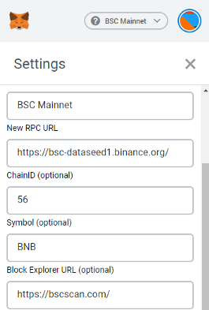
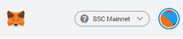

## Setting up Metamask for Binance Smart Chain (BSC)
---
With upcoming expansion of Value DeFi on Binance Smart Chain, here is a quick guide to set up your Metamask wallet for BSC

If you don't already have Metamask wallet installed you can visit [browser extension marketplace](https://chrome.google.com/webstore/detail/metamask/nkbihfbeogaeaoehlefnkodbefgpgknn)

Click import wallet if you have an existing wallet.

If creating new wallet, set up your password and write down and store your seed phrase somewhere safe.

*Note: recent update automatically adds BSC network settings to your Metamask wallet as soon as you click connect wallet*

Next step is adding BSC network, in order to do it, click on Settings -> Networks -> Add network

Input network details as follows:

Network Name: BSC Mainnet

New RPC URL: https://bsc-dataseed1.binance.org/ or https://bsc-dataseed2.binance.org/

ChainID: 56, or 0x38 if 56 doesn’t work

Symbol: BNB

Block Explorer URL: https://bscscan.com/

Click on add and your new network is set. 

You can toggle between desired networks by clicking on top of your wallet.

In order to initiate and pay for any transaction on BSC you need to have BNB in your wallet, much like ETH on Ethereum blockchain

---
