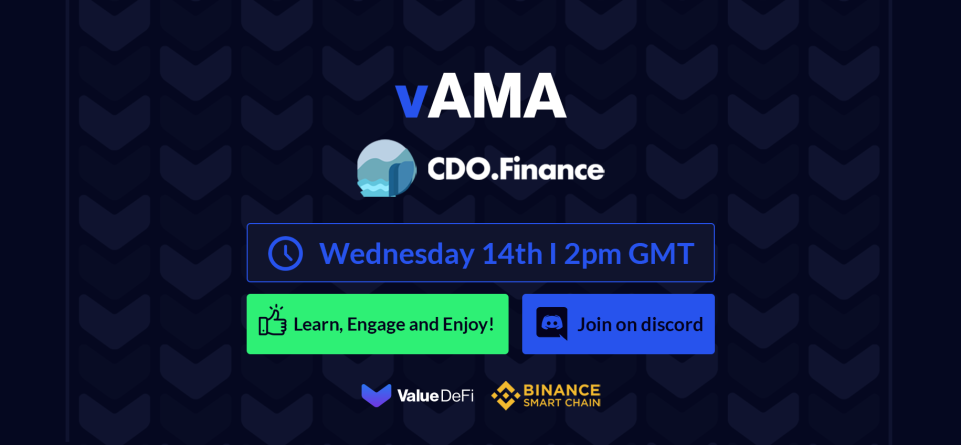

**Prod (Value DeFi)**

Everyone, I'd like to introduce CDO Finance!! We'll be doing a short introduction, then I'll open the chat up for the community to ask some questions.
vAMA guests introduce yourselves.

**GoldenGatsby (CDO finance)**

Hello! I am GoldenGatsby from CDO Finance
Nice to meet everyone from Value DeFi

**Prod (Value DeFi)**

It's very nice to meet you too. We love getting to know our frens! 
Tell us a bit about CDO, and how you got into Crypto?

**GoldenGatsby (CDO finance)**

CDO Finance is our attempt to contribute to the DeFi scene on BSC. Our protocol creates structured finance products on top of underlying yield sources, which are called Collateralized Debt Obligations. Through CDOs, we aim to offer DeFi users the choice of selecting a risk/return profile closest to their investment preference, while maintaining vanilla yield farming functionalities. Users are now basically able to get either risk protection or yield leverage by participating in our tranche pools. I got into Crypto back in 2018, and was involved in a couple of projects in various capacities. My team has also been in the space for some time now.

**satoshivalue (Value DeFi)**

Welcome CDO.finance team, glad to have you here today.

**Prod (Value DeFi)**

Wow, so your project has brought CDO's to DeFi?

**misuDiscord (CDO finance)**

Hi. I'm Misu from the CDO finance team. I've been following crypto since 2015 but finally got into it financially in 2017. I've invested in and advised around 15 projects since then.

**GoldenGatsby (CDO finance)**

We are hoping to create a DeFi version of CDOs yes, with differences in terms of yield origination and actual packaging compared to those in traditional finance.
We believe that having the choice of risk/return tradeoffs would create a more inclusive environment where risk averse or capital constrained investors would now be able to participate in defi yield farming.

**Prod (Value DeFi)**

Really interested in this, offers great user freedom. How does a user select their level of risk? Do you have preset options? Or is it something scalable from 0 risk to max risk?

**GoldenGatsby (CDO finance)**

In our currently designed iteration of our tranche pools, users would be able to choose between a junior and senior tranche. Senior tranche users would obtain a fixed (and lowered) yield that is guaranteed by the investment and yield of the junior tranche; Junior tranche users would obtain a variable yield with leverage depending on the ratio of senior/junior tranche. the greater the amount of senior tranche tvl, the higher the yield leverage that the junior tranche obtains. In the future, we will also look into creating more variations of tranches as well as different yield origination sources.

**Prod (Value DeFi)**

Starting with two tranches is a great idea I think. Reduce confusion. So Senior is 'less' risk than Junior?

**GoldenGatsby (CDO finance)**

Yes, precisely

**Prod (Value DeFi)**

Awesome concept. What will the CDO's contain? Several different yeild-farms? Or other tokens? There's alot you can do with CDO's. Super excited for this

**GoldenGatsby (CDO finance)**

Thanks for the warm support! We plan to start with tranching single yield farms, and proceed to creating mixed yield farms with multiple different yield farms. Would also like to point out the main benefit of this arrangement; instead of having users pay high borrowing fees for yield leverage; or taking on hedging/insurance costs for investment protection, tranche participation would be cheaper and more efficient for users.

**Prod (Value DeFi)**

Less fees means more profit for your users (for anyone watching)
How will you go about picking yield farms?

**GoldenGatsby (CDO finance)**

There are a few choices we are currently considering. Principal considerations would be yield (obviously), incurred transaction fees (possibly entrance/exit fees) and platform stability/risk.

**Prod (Value DeFi)**

Very glad you will be taking critical steps to ensuring the best farms will be selected.
Before I open the chat up for questions, as a final statement; What does CDO want to achieve on DeFi?

**GoldenGatsby (CDO finance)**

Our goals are not very lofty; we would like to contribute a derivative product on BSC that would be a good addition to existing offerings, which could potentially attract a broader base of investors through risk/return versatility.

**Prod (Value DeFi)**

So CDO's aim is to create a product that will allow more users to make the jump from centralized finance to decentralized finance through your reduced risk CDO's

**GoldenGatsby (CDO finance)**

Yes, and also level the playing field for smaller investors through the possibility for cheap yield leverage

**Prod (Value DeFi)**

Big fan of that, it's one of our goals here as well! It's very positive to know we share common goals for our users.
Everyone, I will open the chat now. Make a warm welcome to our guests and ask any question on your mind.

**forkliftdriver**

i'd like to farm nba topshots

**GoldenGatsby (CDO finance)**

That's not currently in our plans

**nath1014**

How will CDO.finance leverage Yield? It seems it's a core function of the CDO tranche products, but not much details on how the leverage is gathered. Thanks

**GoldenGatsby (CDO finance)**

The leveraged yield comes from the surplus yield beyond the fixed yield of senior tranche. Our latest medium article gives a pretty good example of that if you would like to check it out!

**vDodus-b (Value DeFi)**

What are your plans to mitigate the recent supply shock?

**GoldenGatsby (CDO finance)**

We believe that the utility of our tranche pools would create demand for CODEX; as it captures the economic benefits of our platform. Supply shock is temporal and smooths out over time as well.

**barry b.**

CDO? ain't that what caused the 2008 GFC mate? seems a bit suss if you ask me

**GoldenGatsby (CDO finance)**

The issue with CDOs back in 2008 was that it was packaging subprime mortgage loans, i.e bad under collateralized loans. DeFi yield farms are fully collateralized with no risk of a mass default like what happened in the housing market crisis

**TQT (Value DeFi)**

Did you take inspiration from Barnbridge or Saffron and will you be using some of their code?

**GoldenGatsby (CDO finance)**

We have studied our ethereum counterparts including these 2 and more on how they do their risk/reward redistribution, yes

**vSwing**

one of the most fearful things in defi is flash loan attacks. How does the team ensure the safety of the tranche pools that are free from such horrible attacks?

**GoldenGatsby (CDO finance)**

We will undergo a full audit of our tranche pools before release, currently I do not see any flash loan attack vectors for our planned design

**Pon**

Hi and thank you for your time ! What are the purposes of codex token and is there any incentive for holding it?

**GoldenGatsby (CDO finance)**

Codex tokens will 1. capture the economic benefits of our system 2. Serve as governance token in the future

**CMierez**

There's a probably unusual question that I always like to ask on AMAs: What would you say your target demographic is? (If there even is one) Are you looking to attract a certain kind of user, or do you want to reach the general public with your platform?

**GoldenGatsby (CDO finance)**

I think we are looking to attract current yield farmers, as well as participants who are not currently in the system. We envision senior tranche participants to include the likes of traditional funds and risk averse money, while junior tranche participants would be existing yield farmers that would like to increase their yield leverage to get more work out of their money

**nath1014**

Any plans for a timelock of smart contract owner functions (not funds, but any contract calls to the deployed contracts), It'd help a ton for confidence in the system (from rugs etc)

**GoldenGatsby (CDO finance)**

current relevant smart contracts are already owned by a 24hr timelock contract, any malicious action by our team would give the users plenty of time to withdraw their funds safely

**nath1014**

Has the contracts deployed had minimal changes to existing audited contracts of other platforms? And is that why there isn't a rush for official audits just yet. Thanks

**GoldenGatsby (CDO finance)**

We believe our current contracts to be fairly straightforward and similar to other platforms yes, especially since functions are limited atm. We will do a full audit with our tranche pools update

**Leon - Kopter**

Could you also share the plan and the roadmap for the future development ?

**GoldenGatsby (CDO finance)**

Yes, we will release a roadmap soon! it will be posted on our medium

**DDT**

For junior tranches, is it similar to alpaca/alpha mechanism?

**GoldenGatsby (CDO finance)**

not really, alpha (and alpaca by extension) users borrow money from an interest bearing pool to get yield leverage while paying borrowing fees and sustaining liquidation risks
junior tranche users in our case do not pay senior tranche users to "borrow" since we recognise the risk/return tradeoff

**vSalocin**

What's the utility of CODEX token in the grand scheme? What happened to your unlock mechanism and why did it change? Are you planning cross chain migration anytime soon? Is your code built from the ground up and if so how will you manage security issues? Welcome team

**cl (CDO finance)**

Codex tokens are the platform's governance tokens. it will receive economic benefits of the platform such as fees. For the initial launch, we worked off a fork of existing code as we feel it suited our purpose and is familiar to users in the DEFI space - putting codex into the hands of a community that has the ability to provide liquidity to our platform in the future. We had a miscommunication with our dev team on how the unlocking mechanism should be. It didn't change. 80% of codex locked is unlocked linearly over 90 days from the start of emissions. Something got lost in translation and we took it as unlocked AFTER 90 days instead. Nothing can be changed now as the contract is owned by the fair launch contract, that is in turn owned by the timelock. We regret this wrong messaging but at the same time, i think the system fits its purpose. Linearly unlock to ease in supply while liquidity builds. After we get over this initial increase in supply, users minds would be put at ease instead of worrying about the increase to come in 90 days.

**vDodus-b (Value DeFi)**

Any leakies for upcoming partnerships?

**GoldenGatsby (CDO finance)**

We are in talks with several platforms, but no leakies.

**AcharyaOne**

There was an announcement that Token Lock mechanics are a bit different from what was originally announced. I'd like to ask if that is taken into account for those using Value DeFi vSafe auto compound strategy, is Value DeFi vSafe working correctly?

**Prod (Value DeFi)**

I can confirm on our end that all CDO vSafe's have a modified strategy for the linear vested rewards. You have already started receiving them and the APY has already been corrected.

**EsotericPA**

I wish I weren't such a noob and had a useful question to ask

**nath1014**

What's the ETA on Tranches? Or at least what percent completion (roughly)?

**GoldenGatsby (CDO finance)**
We have completed the frontend dev of tranches, and plan to launch by or before Epoch 1 (approximately 7 weeks or less).

**nath1014**

Wow, I didn't expect it so soon! Thanks again for your time and answering our questions!

**Prod (Value DeFi)**

Everyone. Our guests have been amazing answering all your questions, just putting up a 5min warning for final questions so we can let the CDO team get back to their hard work!

**misuDiscord (CDO finance)**

Thanks Value DeFi for this opportunity!

**TQT (Value DeFi)**

Thanks for your time

**GoldenGatsby (CDO finance)**

Thanks to you and everyone else!

**CMierez**

Thank you for your time, indeed

**cl (CDO finance)**

Thank you to the Value Defi team and community. You guys have been awesome and so supportive!

**Prod (Value DeFi)**

Thank you everyone for joining.

