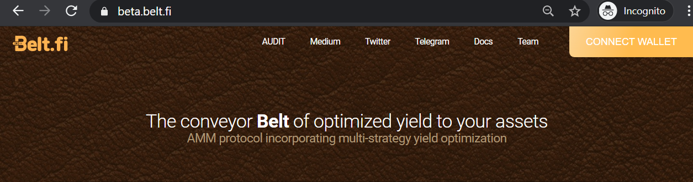
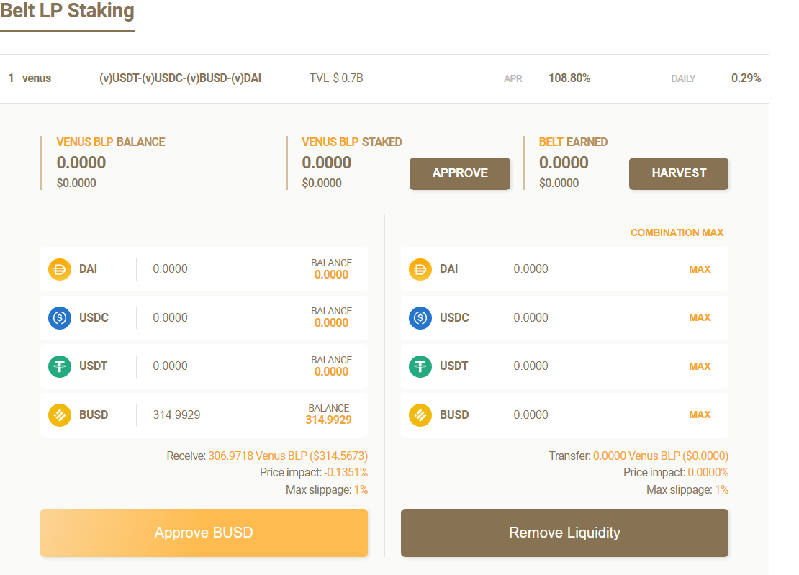
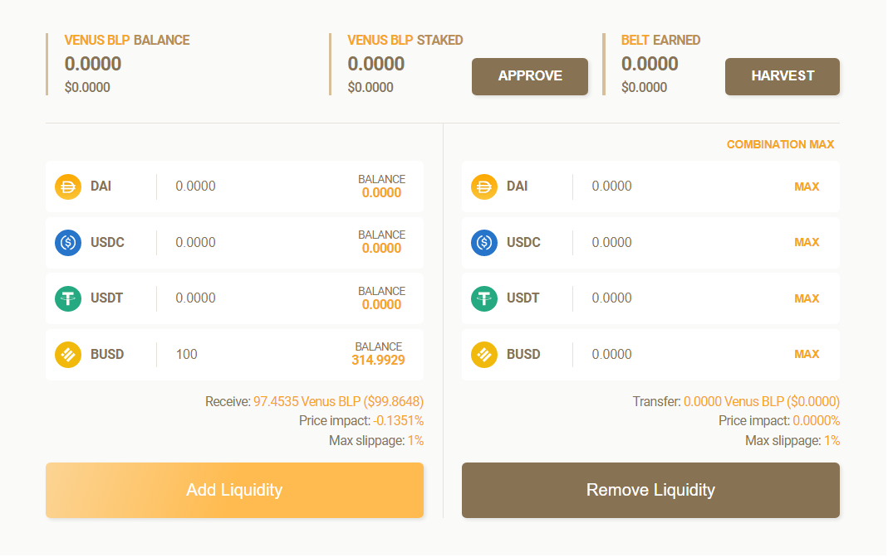
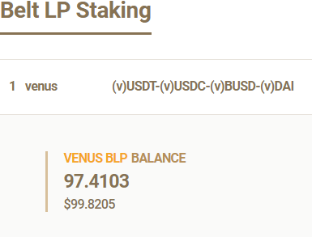

In this guide we will show you step by step instructions on how to add liquidity to Belt.fi and use those LP tokens in Value Defi BSC vSafe to earn interest on your assets  

1. Go to https://beta.belt.fi/ 
2. Connect your wallet

3. Scroll down to Belt LP staking 
4. Approve your stablecoins

5. After you approved you will be able to add liquidity
6. Input your desired amount of stablecoins and click add liquidity

7. After you confirmed transaction your Venus BLP will change

8. Return to the bsc.valuedefi.io vSafe section and add your LPs to effortlessly earn from auto compounding interest.

