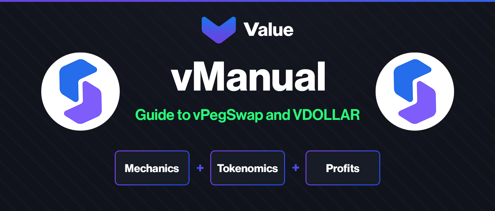
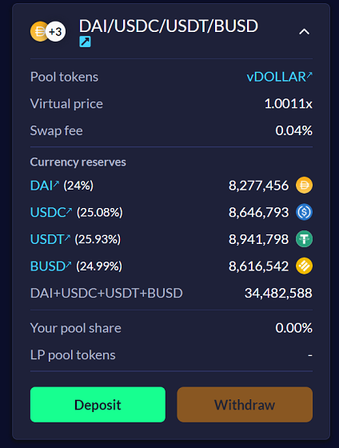
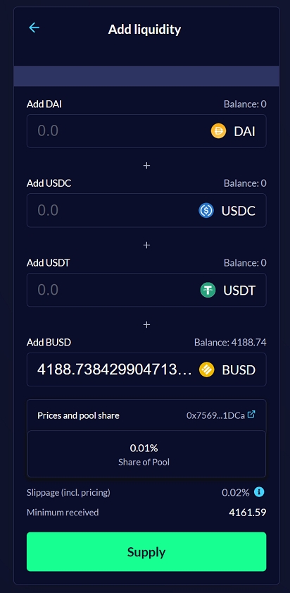
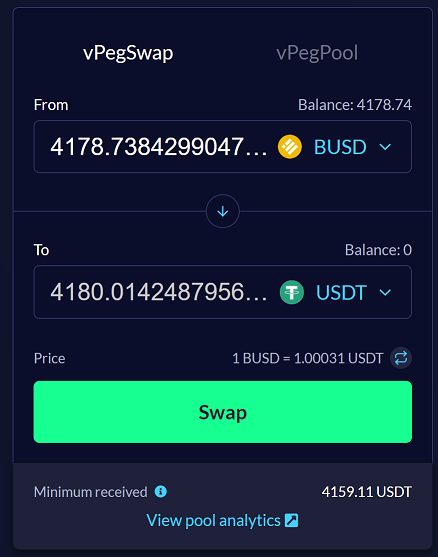

---

vDOLLAR is Value DeFi’s ‘4pool’ Metapool which is a modified implementation of a conventional Curve ‘3pool’. **vDOLLAR is not a tradable token, but rather a combination of four stablecoins: DAI, USDC, USDT and BUSD.** 

The term **metapool** is used for pools that allow for single asset deposits into a pool with multiple tokens.

_vDOLLAR: A ‘4pool’ Metapool_

### DEPOSITING

To obtain vDOLLAR, users simply deposit any of the 4 tokens (can be single or multiple tokens at once) into the metapool to receive vDOLLAR at almost 1:1 ratio. There is a small deduction for slippage + fees, approximately 0.04%.

_Adding liquidity to vDOLLAR_

### WITHDRAWING

To withdraw the liquidity and get your stablecoin(s) back to your wallet, simply click the *Remove liquidity* link. 

Users are free to choose how they withdraw their liquidity, either into any singular token of the four stablecoins or a combination of the four, regardless of their deposit.

_Left: Combination Withdrawal | Right: Single Asset Withdrawal_

### USING vPEGSWAP

Simply go to our [vPegSwap page](https://bsc.valuedefi.io/#/vpeg-swap) and use our user-friendly interface to swap your stablecoins. 
Immediately users will be able to notice the massive reduction in slippage and fees. 

To use vPegSwap as a trader, the process is as simple as swapping on vSwap or any other DEX. First, choose your desired token to trade, then select the token you wish to receive, and enjoy the massive reduction in slippage and fees. Since the fees are miniscule, you can actually benefit off swapping if either or both tokens are slightly off their peg.

_Using vPegSwap to gain stablecoins_

To use vPegSwap as a liquidity provider, you simply need to deposit some stables to receive vDOLLAR.

To enter a specific liquidity pool, the same simple and highly user-friendly system applies, you are only required to deposit one of the stablecoins and the pool will balance accordingly.

