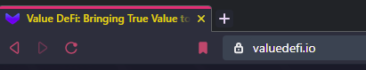
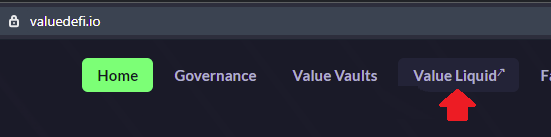
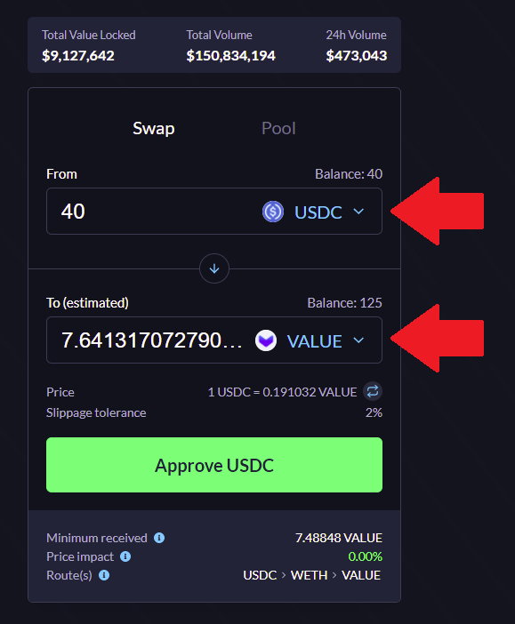
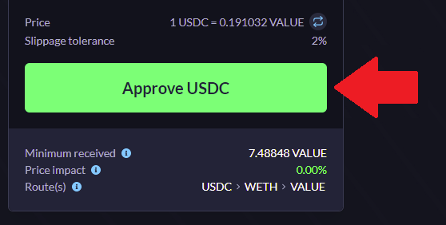
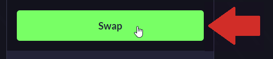
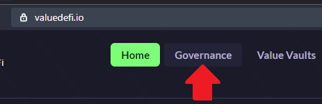
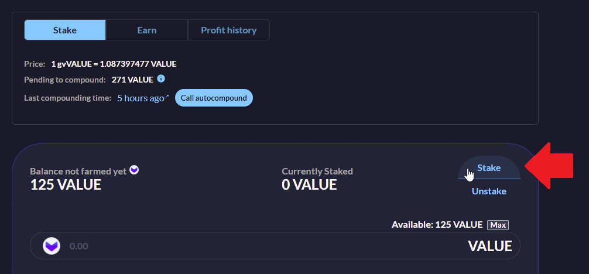
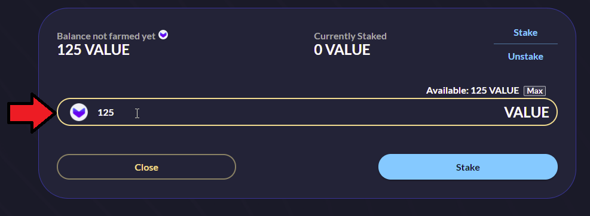
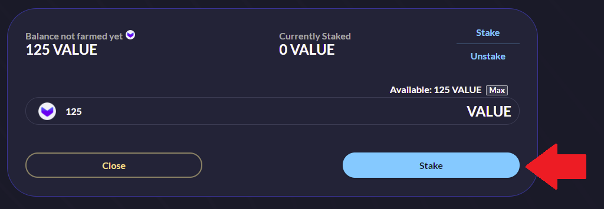

--- 
In this tutorial, we’re going to walk you through the step-by-step process on how to purchase $VALUE on vSwap, stake it in vGov on Ethereum Mainnet and bridge it over to BSC to receive extra rewards. For the sake of simplicity, we will be using https://metamask.io/ as the default wallet for this tutorial.

---

#### PART 1 - PURCHASE YOUR $VALUE TOKENS

There are many ways to purchase $VALUE but this tutorial will focus on our decentralized exchange; vSwap.

**INSTRUCTIONS**

1. Go to https://valuedefi.io/ on your web browser  

2. Click the “_Value Liquid_” button on the header  

3. Connect your MetaMask wallet to the site

4. Select the token you would like to exchange _from_ and select $VALUE as the token you would like to exchange _to_  

5. Approve both tokens (one-time transaction). While cumbersome, this is a security measure in order to prevent malicious contracts from sending tokens you haven’t first authorized  

6. Click on the ‘_SWAP_’ button  

7. Preview the transaction in the pop-up window of your MetaMask

8. Confirm the transaction request in your wallet and wait for a few minutes

Congratulations, you now own $VALUE tokens in your wallet!

#### PART 2 - OBTAIN YOUR gvVALUE TOKENS

**For users who are NOT in the vGov (Governance Vault) currently**

In order to obtain your gvVALUE tokens; which is the asset that will be bridged across the Ethereum Mainnet and the Binance Smart Chain (BSC) Mainnet, you will be required to stake your $VALUE tokens to the vGov (formerly known as the Governance Vault). **When you stake your $VALUE tokens to the vGov, your $VALUE will be wrapped into a new token called $gvVALUE. When you unstake your $VALUE from the vGov, your $VALUE tokens will be unwrapped from $gvVALUE. If you send your $gvVALUE to another wallet, that new wallet will be able to redeem the $VALUE tokens using the vGov."

**INSTRUCTIONS**

1. Go to https://valuedefi.io/governance  

2. Click the 'Stake' button  

3. Enter the amount you wish to stake  

4. Approve the one-time transaction and wait a minute

5. Click the 'Stake' button  

Congratulations, your $VALUE tokens are now staked and earning profits from Value DeFi Ethereum ecosystem! As proof of ownership of your share in vGov, you should have received $gvVALUE tokens in your wallet! (refer to the paragraph above).
 
 
**POPULAR QUESTIONS**

_1) Can you add $gvVALUE as a custom token to your MetaMask?_

Yes you can, here are the token parameters:  
    - Token address: 0x49e833337ece7afe375e44f4e3e8481029218e5c  
    - Token symbol: gvVALUE  
    - Token of precision: 18  

_2) Why is my $gvVALUE amount lower than the amount of $VALUE that I have staked?_

vGov earns 35% of swap fees from vSwap and 16% performance fees from vSafes and it is autocompounded for all vGov stakers. Your gvVALUE amount will always stay the same (unless you stake more $VALUE), but your $VALUE amount will increase over time.

_3) I'm currently staking in the vGov but I don't see my $gvVALUE in my wallet, what do I need to do?_  

This scenario will happen if you staked to the vGov prior to November 2020. Don't worry, your $gvVALUE are in the smart contract of the vGov and we have introduced a 'Unlock' button for you to click in order to redeem and consolidate your $gvVALUE into your wallet. If you go to the vGov page and you see the "Unlock" button, it means you have some $gvVALUE tokens to redeem! Note this is a one-time event and the button will not appear if all your $gvVALUE is already in your wallet.	

 
#### PART 3 - BRIDGE YOUR $gvVALUE to BSC and receive $gvVALUE-B

Now that you have your $gvVALUE tokens in your wallet, you will need to use our portal to bridge your $gvVALUE into $gvVALUE-B.  The two assets are pegged 1:1 and you may use this portal to bridge your $gvVALUE and $gvVALUE-B back-and-forth as needed.

**INSTRUCTIONS**

1. Select BSC bridge on Value DeFi UI
2. Select asset you want to bridge over (vUSD or gvVALUE)
3. Approve (one time transaction)
4. Select amount that you would like to bridge over
5. Select BSC address
6. Bridge over

#### PART 4 - STAKING ON Binance Smart Chain (BSC)

**INSTRUCTIONS**

You need to be sure your selected network is _Binance Smart Chain (BSC)
_
1. Go to https://bsc.valuedefi.io/#/vfarm
2. Select the '_98% gvVALUE-B - 2% BUSD_' pool (direct link: https://bsc.valuedefi.io/#/vfarm/0xd56339F80586c08B7a4E3a68678d16D37237Bd96/4)  

_In order to stake in this pool, you need to have 98% of US dollar equivalent in $gvVALUE-B and 2% of US dollar equivalent in $BUSD.  You can preview your required amount by using staking UI and selecting the 'MAX' button (the required $BUSD amount will be be displayed automatically). You can use vSwap to buy more $BUSD as necessary ($BUSD is Binance's stablecoin).

3. Approve both assets
4. Click the '_Stake LP_' button
5. Enjoy your passive income from ETH and BSC

