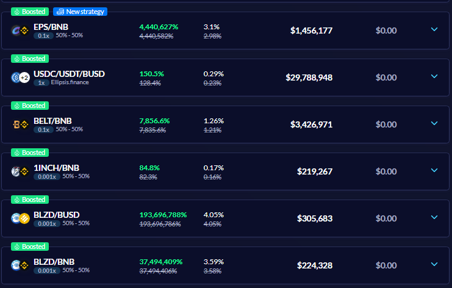

---
id: vSafes
title: vSafe
sidebar_label: vSafe
---
---

**OVERVIEW**  

vSafes are cutting-edge yield aggregators that use multiple strategies and auto-compounding technology to provide investors with high returns on their deposited assets. In simpler terms, a vSafe will search for the best farming targets, deposit your investment, trade farming rewards for deposited tokens, and re-invest automatically. 

The auto-pilot nature of vSafe makes it very simple to use, as no manual maintenance is required to increase the size and value of invested assets.  

**KEY FEATURES**  
   1. _Auto-compound:_  

> _Compound interest is the eighth wonder of the world. He understands it, earns it... he who doesn't...pays it._

-- Albert Einstein

This feature saves you time, effort, and gas while giving you peace of mind as your investment is being maximized at all time. Auto-compounding does not simply increase your LP count over time.  Instead, it is the dollar value of the LP (YOUR SHARES) that increases so when you remove the liquidity from the pool, you will get a lot more tokens than what was previously deposited.

   2. _Multiple strategies:_  

One unique feature of vSafes is that they can use multiple strategies to farm multiple pools. You thus get the best return by having your fingers in many pies.
  
The infographic below shows how we optimize vSafe funds to increase yield. To prevent dilution of the APY of the farmed pool, only a part of the vSafe funds is allocated to the pool, so the pool APY is less affected.

For example, allocating $1M of our vSafe would bring the Farm $2M TVL (1M+1M), providing us with a 55% APY (110%/2).

Likewise, the other funds in vSafe are distributed to other farms to acquire the best returns on the deposited vSafe assets, resulting in a 50% APY compared to 10% APY of single assets.

   3. _Double earning:_

Some of our vSafes, in addition to auto-compounding features, offer its users additional vBSWAP incentives. Those pools have green "Boosted" tag on their respective vSafe tab.

Users who choose to earn additional vBSWAP and stake their shares will still earn auto-compounding benefits from their deposit in the background.

To access "Boosted" feature simply enter your vSafe UI and click Deposit and stake, our system will do both transactions for you. 
If Boosted is newly added feature on vSafe where you already have funds deposited, simply click on "Stake your shares" button on vSafe UI where you will be taken to next screen, deposit your shares and enjoy your double earning from single asset.

**GETTING STARTED**  
- BSC: https://bsc.valuedefi.io/#/vsafe
- Ethereum: https://valuedefi.io/value-vaults  

