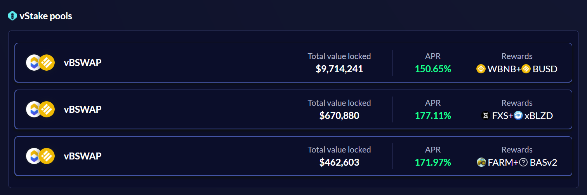
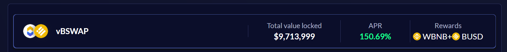
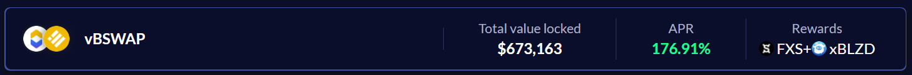
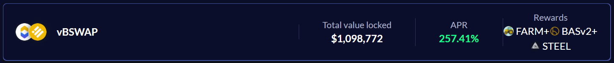

---

### OVERVIEW
vStake is an additional level to Value DeFi’s vSwap, designed as a massive improvement to conventional staking pools. vStake pools are actually active liquidity, while your standard single asset staking pools are dead liquidity. This may appear similar to vFarm, but all vStake pools are created to be 98/2 ratio, which should be noted that other AMMs are not capable of doing. This 98/2 ratio limits any potential impermanent loss to almost nothing. Even with 98/2 pools, vStake is still subjected to all the benefits of vSwap’s with the best exchange rates and slippages. 
Also, vStake is designed to be the perfect product to farm with your vBSWAP tokens and/or rewards. vBSWAP is a part of the Value DeFi BSC ecosystem, created to serve as a profit-share and incentive token. 

### vStake Pool 1: WBNB + BUSD
The rewards from this pool come purely from BSC ecosystem profit-share. This vStake pool is an Official Value DeFi pool and will run indefinitely. 

### vStake Collaboration Pools:
vStake pool 2 & 3 example, 100% project collaboration rewards.

KEY FEATURES
1. Minimal slippage (98/2 pools)
2. Active liquidity which can be used to trade/swap at vSwap.
3. Receive profit-share from our ecosystem. 
4. Receive rewards from our collaborations with other projects.
5. Receive additional swap fees.

### GETTING STARTED
BSC:[vStake](https://bsc.valuedefi.io/#/vstake)
