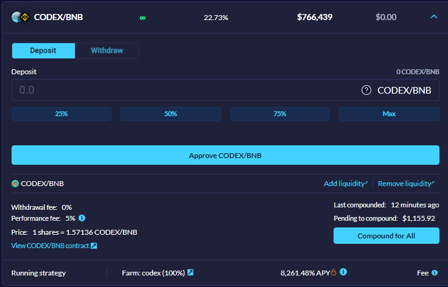
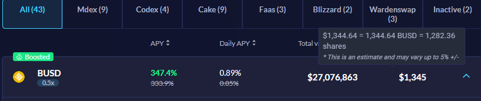
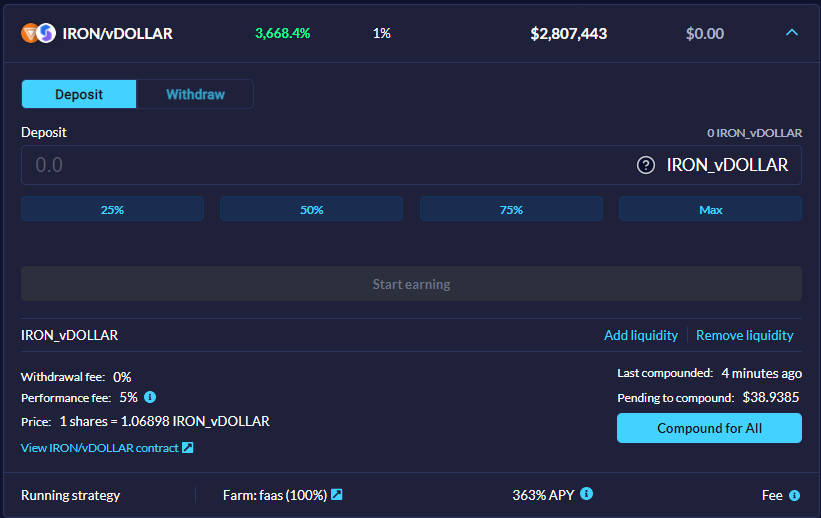

---

##### 1. What is vSafe?

vSafe is a yield aggregator that will search for the best farming targets, deposit your investment, trade farming rewards for deposited tokens, and re-invest automatically.

It compounds your deposited assets frequently, ranging from once every few hours to once per hour, depending if yield is higher than $200 during that period as more frequent harvests with lower yield might actually reduce returns. 

##### 2. If vSafe auto-compounds, why is there a Compound for all button?

vSafe frequently auto compounds but users who wish to increase compounding frequency or who are withdrawing from vSafe are able to press the “Compound for all” button in order to squeeze a bit more profit before withdrawing.

##### 3. When i deposit my LPs i get less shares, why and what are shares?

Shares are proof of deposit tokens and a way that vSafe calculates auto compound for each user equally. 

In this example if you deposit 100 CODEX/BNB LP tokens you would receive 63.63 vSafe CODEX/BNB shares (100/1.57136 = 63.63). Over time as vSafe auto compounds, for example, 1 share will be worth 2.4 CODEX/BNB so when you withdraw you would receive 152.71 CODEX/BNB LP tokens (63.63*2.4=152.71) which would make your profit 52.71 CODEX/BNB LP tokens.

##### 4. What is the lock symbol and why am I getting less than it is shown on UI?

Some of our vSafes are using strategies that are dealing with locked/vested/delayed reward emissions, you can find general principles how it works [here](https://docs.valuedefi.io/guides/vFarmvsvSafe) but we will be adding vSafe overview with more detailed release schedule soon.

This is just short overview of our currently locked strategies

| Name         	| Instantly claimable  	| Locked / burned                                                                                                        	| True Daily APY pre reward release    	|
|--------------	|----------------------	|------------------------------------------------------------------------------------------------------------------------	|--------------------------------------	|
| Alpaca       	| 30%                  	| 70% rewards from previous farming period released from [block](https://bscscan.com/block/countdown/6499649) for 7 days 	| 70% lower than displayed due to lock 	|
| Codex        	| 20%                  	| 80% released linearly from apx [block](https://bscscan.com/block/countdown/8891201)                                    	| 80% lower due to lock                	|
| Ellipsis     	| 50%                  	| 50% burned (already calculated in APY)                                                                                 	| APY accurate                         	|
| Iron.finance 	| 30%                  	| 70% locked till [block](https://bscscan.com/block/countdown/6675734) then linearly released for 90 days                	| 70% lower due to lock                	|
| Nerve        	| 33.33%               	| 66.66% linearly released at apx [block](https://bscscan.com/block/countdown/11483201)                                  	| 66% lower due to lock                	|

##### 5. What is deposit and stake?

Some vSafes have boosted tags which means users have the option to stake their vSafe shares for additional vBSWAP incentives. If users choose to do so, external portfolio trackers such as growing.fi, farm.army or vfat.tools will only display your APR of vBSWAP incentives, not the compounding APY of vSafe that is done on the back end. 

##### 6. Why is my USD amount displayed on vSafe UI lower, same, higher?

As the tooltip says, USD amount is estimated and may vary, best advice is to use an external tracker such as growing.fi, farm.army or vfat.tools and be aware that it will not display your deposited amount and yield if you staked your shares.

##### 7. Why are there two apy numbers and which one is real?

Green apy number is calculated as compound interest with optimal 8760 compounds per year (once per hour). APY in white letters at bottom of the screenshot is one of our strategies or liquidity mining pool/vault that we are using.

##### 8. What is the performance fee?

Performance fee is a fee that is paid out from vSafes profits and is already calculated in APY, it doesn't affect your capital as we have no deposit or withdrawal fees.
