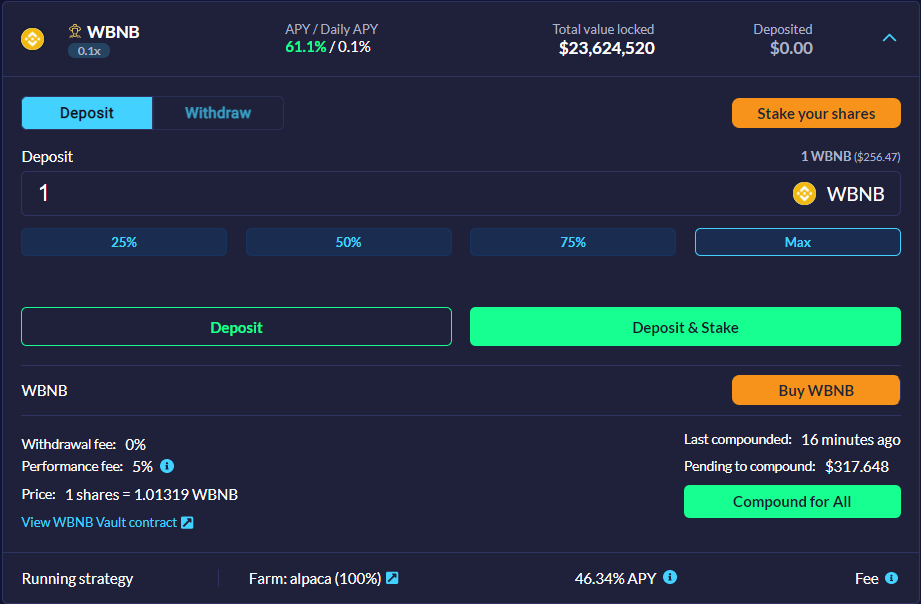
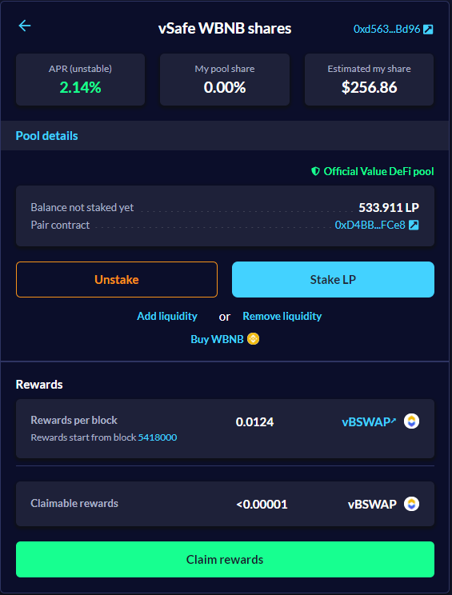

---
id: vSafe-guide-on-binance-smart-chain
title: Guide on how to stake to a vSafe on Binance Smart Chain
sidebar_label: Stake in a vSafe
---
---
In this guide we will give you step-by-step instructions on how to stake and maximize your profits using our multi strategy auto compounding vSafes. For the sake of simplicity, we will be using https://metamask.io/ as the default wallet for this tutorial.  

### SCENARIO - vSafe that uses PancakeSwap as the Liquidity Pool (LP)  

For this example, we will use the IOTX/BUSD vSafe (50%-50% liquidity pool).  

**INSTRUCTIONS**  

1. Visit the Value DeFi (BSC) site - https://bsc.valuedefi.io/#/  

2. Connect your MetaMask wallet to the site by clicking the "_Connect wallet_" button located on the top-right side of your screen  

3. Click the "_vSafe_" link on the navigation bar to access the vSafe page  

4. Select your desired vSafe (here, IOTX/BUSD)  

5. In order to stake to a vSafe, you first need to add liquidity to Liquidity Pool (LP). The principle is the same in every decentralized exchange; you add two tokens and in return you receive one LP token that represents the share of your liquidity in that pool.  

6. Clicking the 'Add liquidity' link will redirect you to PancakeSwap. Once on this page, you will need to connect your wallet and add an equal amount of USD value of IOTX and BUSD (50-50 Liquidity Pool). If you don't already own the desired amount, you will have to purchase some first. You will also need to "_Approve_" both tokens and click the "_Supply_" button afterwards. Once the transaction is successful, your IOTX and BUSD balance will decrease and you will receive IOTX/BUSD liquidity pool tokens in your wallet .

7. After you successfully provide liquidity to the IOTX/BUSD pool, you should return to the https://bsc.valuedefi.io/#/vsafe page and deposit your IOTX/BUSD LP tokens to the vSafe.  

8. Once on the vSafe page, you will need to "_Approve_" your IOTX/BUSD tokens, click the "_Max_" button to deposit all your eligible LP tokens and click the "_Start earning_" button.  
  

Congratulations, you are now effortlessly earning from your deposited assets!  

Certain vSafes, such as BUSD, BTC-BNB, CAKE, CAKE-BNB and WBNB have additional rewards for users who choose to stake their vSafe shares

Simply click "Deposit and stake" and with one click enjoy the benefits of double earning with single asset

You can check your staked shares by clicking on "Stake your shares" button which will lead you to your vFarm UI where you can see your vBSWAP rewards accruing

We plan to update our UI so you can track your portfolio more accurately from our website. Until then, we recommend you use https://vfat.tools/bsc/valuedefi/ portolio tracker to track your earnings.  
