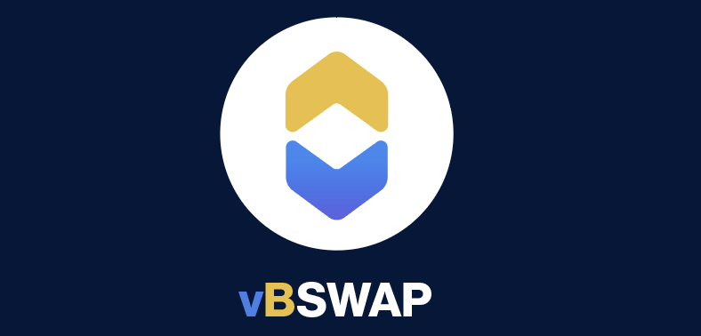
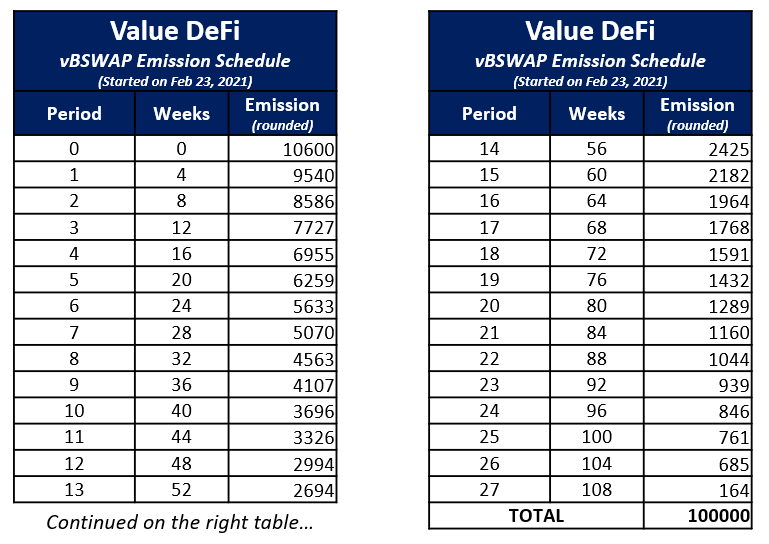

---

**INTRODUCTION**  
vBSWAP is a new deflationary farming token on Binance Smart Chain (BSC) for the Value DeFi ecosystem. vBSWAP has been built and deployed on BSC with a 100K Total Supply distributed over 2 years of farming. Emissions will reduce by 10% every 4 weeks. Additionally, 100% profit from vSafe, vSwap and vPegSwap trading fees on BSC will be used to buyback vBSWAP to be burned, reducing the total supply overtime.
  
  
**TOKENOMICS**
  - _TOTAL SUPPLY_: 100,000 tokens

  - _DISTRIBUTION_:  
        - The tokens will be distributed over a period of 2 years and its emission will be reduced by 10% every weeks (refer to the schedule below)  
        - 5% of emission goes to the _Reserve Fund_ contract for distribution to marketing, community, and giveaways  
        - None of the tokens are allocated the _Dev Fund_  

  - _BUYBACK, BURN and FEES_:  
        - 100% of fees collected on the Value DeFi BSC ecosystem will go to buyback vBSWAP and burn it automatically  
        - 50% of swap fees from vSwap (swap fees are setable by pool creator at vSwap, not fixed)  
        - 50% of swap fees from vPegSwap  
        - All performance fees (typically 6%) from vSafe  
        - All other fees from vFarm (FaaS)  
  

**Token details in case you wish to add it to your MetaMask**  
    - Network: Binance Smart Chain (BSC)  
    - Ticker: vBSWAP  
    - Token of Precision: 18  
    - Token Address: 0x4f0ed527e8A95ecAA132Af214dFd41F30b361600  

---
