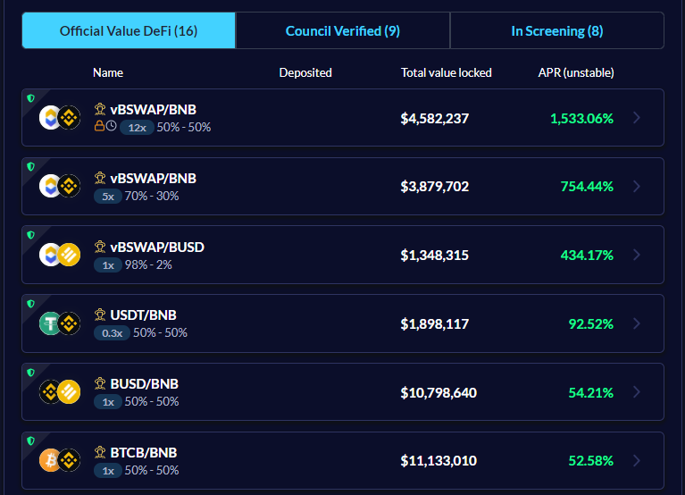
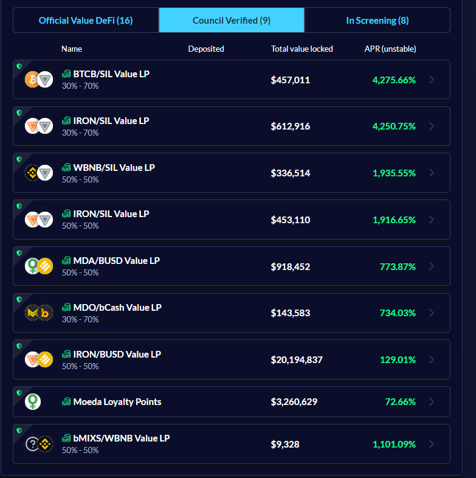
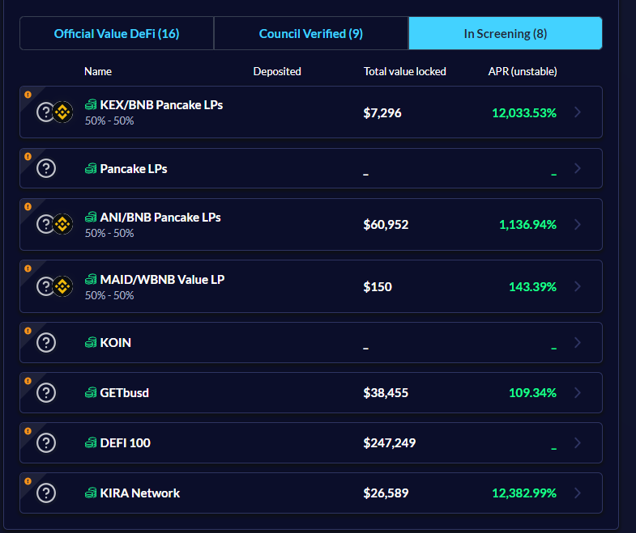
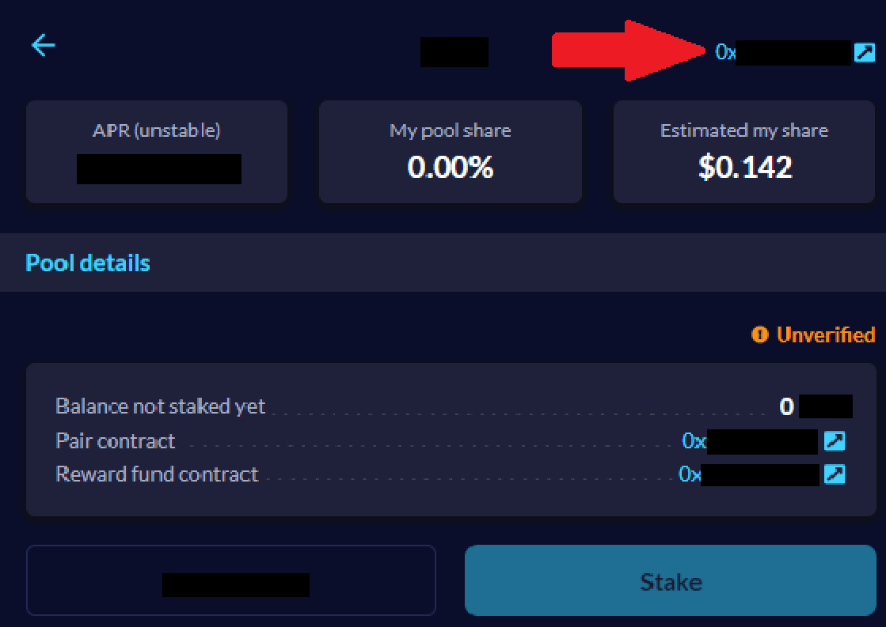
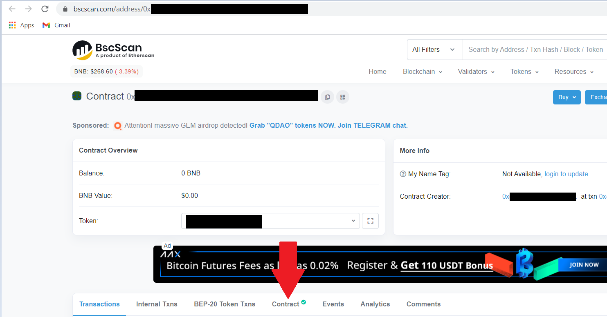
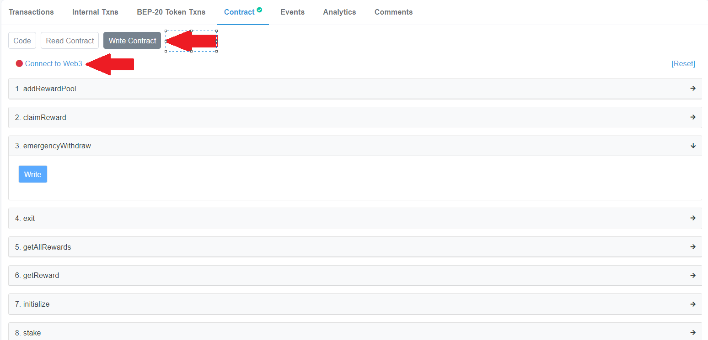
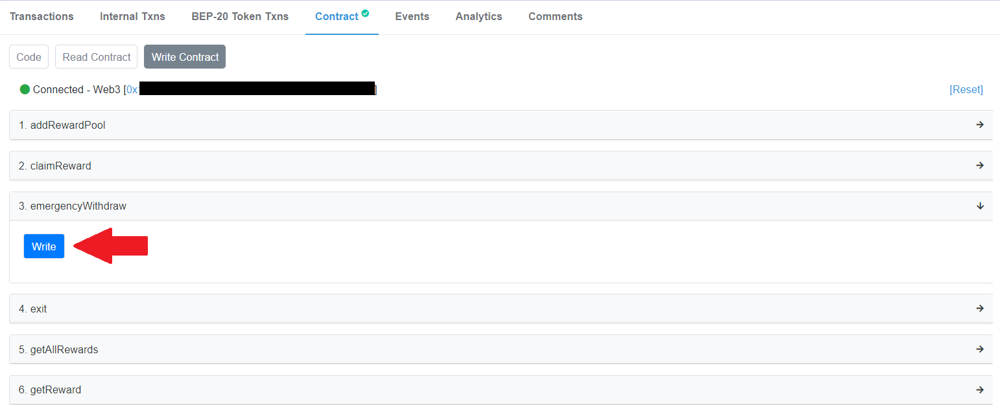
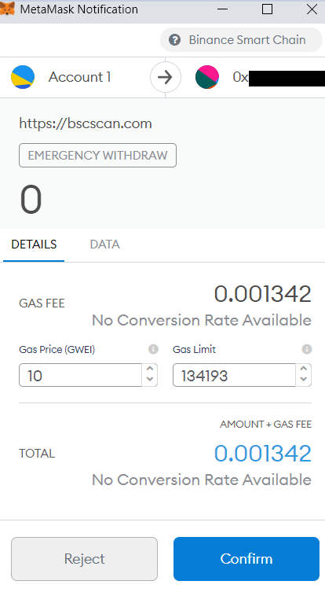
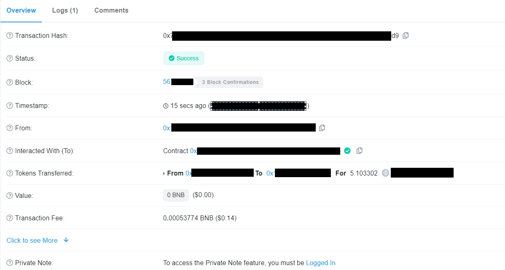
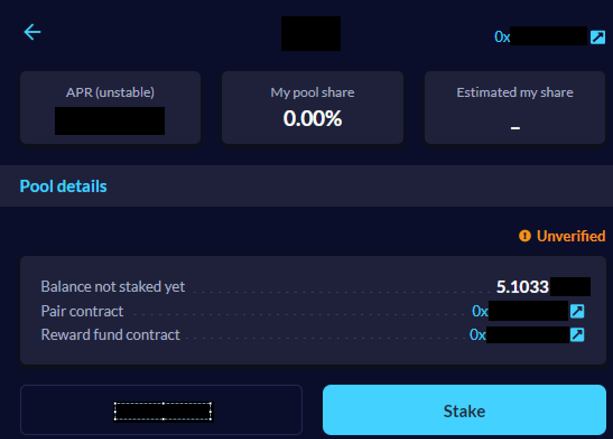

---

### OVERVIEW
FaaS (vFarm) is a permissionless and decentralized service/product of Value DeFi ecosystem and as such, we are not able to control who creates the pools, There are three types of pools, each shown in a different tab, available on vFarms 

1. The first one is ***Official ValueDefi vFarms**. These are the pools created by Value DeFi

2. The second one is **Council-verified vFarms**. These are the projects that have been created by non-Value Defi entities that have passed Council verification

FaaS council is a group of 11 community members that have been selected to do background checks on projects that create their vFarms on Value DeFi FaaS. FaaS council checks social media presence, roadmap, tokenomics, and contracts of a certain project, then gives out yay or nay vote to decide whether to whitelist the project’s vFarm with simple majority rule. However, FaaS council is not a professional auditing company and their whitelisting of projects is neither security guarantee nor investment advice. It is simply a temporary placeholder that will be replaced when a full cross-chain Governance system
is developed and implemented, allowing VALUE stakers to do the whitelisting process.

3. The third tab is **in-screening/unverified vFarms**. These are the projects that got their vFarms created recently, did not contact ValueDeFi staff or community members to start the whitelisting process, or simply did not receive enough yay votes from the Council. These vFarms usually have high APYs so they can be considered high risk - high return investments.

As FaaS is permissionless, Value DeFi has no control over those vFarms so please do your own research for each project that you plan to invest money in. **Knowledge** is your **first** and **last** line of defense against potential malevolent actors.

In case you ever suspect you invested in a project that may be fraudulent, every vFarm contract has an emergency withdrawal function that you can use by following a few simple steps. However, this will also forfeit any rewards that you have accumulated over time and will just return your staked assets.

### EMERGENCY WITHDRAWAL INSTRUCTION

Instruction is done with Metamask on a PC.

Every vFarm has contract address in its upper right corner of your UI

Once you click on it, you will be redirected to BSCscan address of that vFarm where you will be able to click Contract 

After that, find “Write contract” where you will need to connect your Metamask wallet to BSCscan

After you have connected to BSCscan, your address will be shown at the top of the screen with a green dot and you will need to click “Write” under 3. emergencyWithdraw

After you click it, Metamask pop-up notification will appear where you will need to confirm the transaction

After which you will be able to see your successful transaction

And your deposited funds are back in your account.

